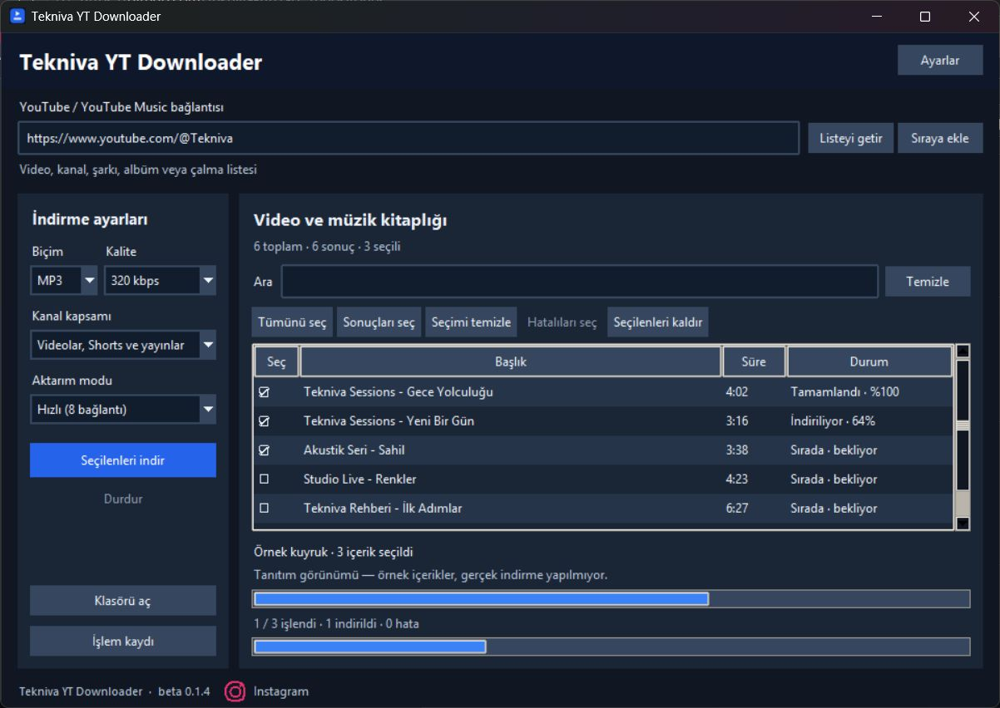
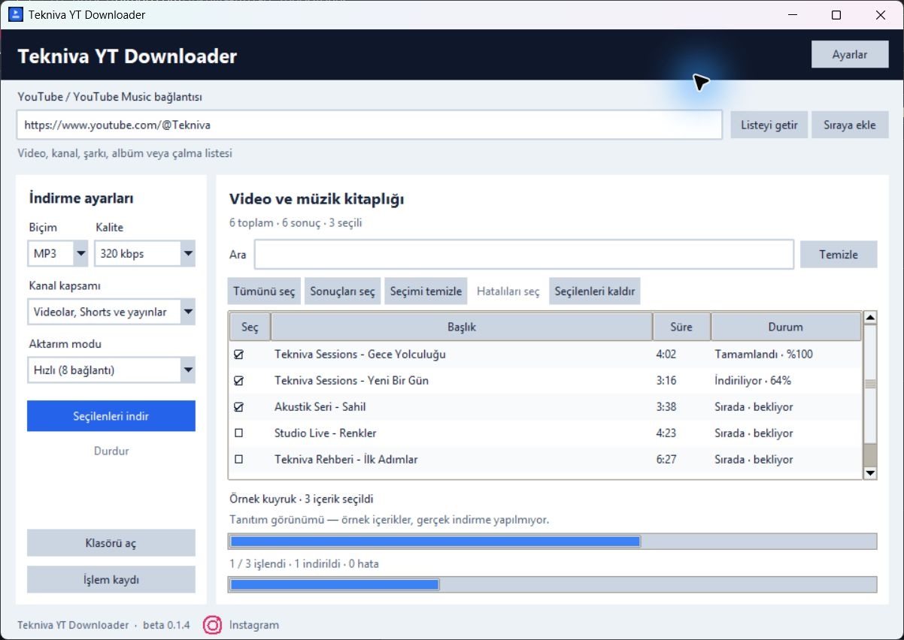
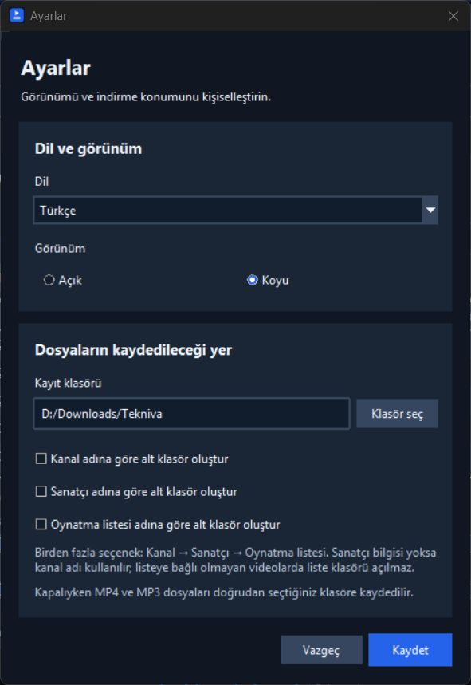

# Tekniva YT Downloader

[](https://github.com/Tekniva-AI/tekniva-yt-downloader/releases)
[](#kurulum)
[](LICENSE)
[](https://github.com/Tekniva-AI/tekniva-yt-downloader/actions/workflows/ci.yml)

YouTube ve YouTube Music bağlantılarından seçtiğiniz videoları **MP4**, şarkıları **kapak resmi içeren MP3** olarak indiren, yedi dil destekli açık kaynak Windows masaüstü uygulaması.

**[Windows için indir →](https://github.com/Tekniva-AI/tekniva-yt-downloader/releases/tag/v0.1.6-beta)** · [Değişiklikler](CHANGELOG.md) · [Katkıda bulun](CONTRIBUTING.md) · [Topluluk](https://github.com/Tekniva-AI/tekniva-yt-downloader/discussions) · [Instagram](https://www.instagram.com/tekniva.com.tr/)

## Ekran görüntüleri

Görseller beta 0.1.4 arayüzünü gösterir; beta 0.1.6 ek olarak uygulama içinden bileşen kurulumu sunar. Listelerdeki içerikler tanıtım için hazırlanmış örneklerdir.

### Koyu görünüm



### Açık görünüm



### Ayarlar



## Özellikler

- Tek video, kanal, Shorts, yayın kaydı, oynatma listesi ve desteklenen YouTube Music şarkı/album bağlantıları.
- Sıraya ekleme, yeniden açılışta kuyruk koruma ve yalnızca seçilen içerikleri indirme.
- Türkçe karakterlere duyarlı arama; başlık, süre, seçim ve duruma göre sıralama.
- MP4 için mevcut en yüksek kalite veya 2160p, 1440p, 1080p, 720p, 480p, 360p sınırı.
- MP3 için 128, 192 ve 320 kbps seçenekleri; JPEG ön kapak ve ID3v2.3 etiketleri.
- Yüzdelik indirme durumu, aktarım ve toplam kuyruk ilerlemesi; durdurma ve hata kayıtları.
- Uygun bağlantılarda aria2 ile 8/4/1 bağlantı; geçici hatalarda sınırlı yeniden deneme.
- Sadece içerik başlığından oluşan dosya adları. Aynı başlıkta farklı içeriklere çakışmayan adlar atanır.
- Varsayılan olarak doğrudan seçilen klasöre kayıt. İsteğe bağlı kanal, sanatçı ve oynatma listesi alt klasörleri.
- Silinen veya boş kalan dosyayı yeniden indirme. Yardımcı kayıtlar indirme klasörüne yazılmaz.
- Açık/koyu görünüm; Türkçe, English, Deutsch, Français, Español, العربية ve हिन्दी.

## Kurulum

1. [Release sayfasından](https://github.com/Tekniva-AI/tekniva-yt-downloader/releases/tag/v0.1.6-beta) `Tekniva-YT-Downloader-0.1.6-Windows-x64.zip` dosyasını indirin.
2. ZIP'i yazma izniniz olan bir klasöre çıkarın. Uygulamayı ZIP'in içinden çalıştırmayın.
3. Node.js eksik veya eskiyse ilk listeleme/indirme işleminde uygulama kurulum onayı ister. **Evet** seçildiğinde resmi Node.js bileşeni otomatik indirilir, doğrulanır ve uygulama klasörüne eklenir. İşlem daha sonra kendiliğinden devam eder.
4. `Tekniva YT Downloader.exe` dosyasını açın. Python, FFmpeg ve aria2 pakete dahildir. Tek EXE indirdiyseniz onu da yazılabilir bir klasöre koyup açın; aynı otomatik bileşen kurulumu çalışır.

Eksik Node.js için sistem kurulumu, PATH değişikliği veya yönetici izni gerekmez. Uygulama `tools/node-v22.23.3/node.exe` ve Node.js lisansını kendi klasöründe tutar. EXE ve ZIP aynı davranışı sunar. İlk bileşen kurulumu internet bağlantısı gerektirir; sonraki açılışlarda yerel kopya yeniden kullanılır. İndirme sırasında yüzde gösterilir ve iptal edilebilir. Onayı reddetmek işlemi başlatmaz; daha sonra yeniden deneyebilirsiniz.

Hedef platform Windows 10/11, 64 bit. macOS/Linux paketleri şu anda yayımlanmıyor. Uygulama beta aşamasındadır ve Windows için kod imzası bulunmaz.

Release içinde taşınabilir ZIP, ayrı EXE ve `SHA256SUMS.txt` bulunur. Kaynak kodu arşivleri GitHub tarafından ayrıca sunulur. ZIP lisansları ve kullanım belgesini de içerir. Yeni sürüme geçerken aynı klasördeki EXE'yi değiştirebilirsiniz; kişisel ayarlar uygulama klasöründe tutulur.

İndirilen dosyanın bütünlüğünü kontrol etmek için PowerShell'de:

```powershell
Get-FileHash .\Tekniva-YT-Downloader-0.1.6-Windows-x64.zip -Algorithm SHA256
```

Çıkan değeri release içindeki `SHA256SUMS.txt` ile karşılaştırın.

## Kullanım

1. **Ayarlar** menüsünde kayıt klasörünü, dili ve görünümü seçin.
2. Video, kanal veya oynatma listesi bağlantısını yapıştırın ve **Listeyi getir** düğmesine basın.
3. Başka bağlantıları aynı listede biriktirmek için **Sıraya ekle** kullanın.
4. MP4 veya MP3 biçimini ve istediğiniz kaliteyi seçin.
5. İndirmek istediğiniz satırları işaretleyin. Arama sonuçlarını topluca seçebilir, seçimi temizleyebilir veya seçilenleri listeden kaldırabilirsiniz.
6. **Seçilenleri indir** düğmesine basın. Liste satırında durum ve yüzde görünür; bitince **Klasörü aç** ile dosyalara erişin.

Tek video bağlantısında video otomatik seçilir; kanal/listelerde seçim size bırakılır. Arama dışında kalan seçimler korunur. Arama yapmak seçili diğer videoları seçimden çıkarmaz. Kanal kapsamı ayarı yalnızca kanal bağlantılarını etkiler. Video bağlantısında oynatma listesi parametresi varsa yalnızca o video listelenir; tüm liste için `playlist?list=...` bağlantısını kullanın.

### Klasör düzeni

Varsayılan kayıt:

```text
Seçilen klasör/
  Video başlığı.mp4
  Şarkı başlığı.mp3
```

Ayarlar'daki alt klasör seçenekleri birden fazla etkinleştirilirse **kanal → sanatçı → oynatma listesi** sırasıyla birleşir. Sanatçı bilgisi yoksa kanal adı kullanılır. İçerik bir oynatma listesinden gelmiyorsa oynatma listesi klasörü oluşturulmaz. Klasör adları güvenli dosya adlarına dönüştürülür.

Uygulama klasöründeki `ayarlar.json`, `kuyruk.json`, `veri/` ve `islem-kayitlari/` kişisel yerel kayıtlardır. Bunlar Git'e dahil edilmez. Tamamlanan indirmelerin çıktısında yardımcı JSON/TXT veya ayrı kapak dosyası bırakılmaz; devam eden indirmelerde geçici parçalar görülebilir.

### Kalite ve hız

**En yüksek**, YouTube'un o içerik için sunduğu mevcut video/ses akışlarını seçer. MP4 bir kapsayıcıdır; VP9, AV1 veya Opus içerebilir ve eski cihazlarda oynatılmayabilir. MP4 çıktısında sırf uyumluluk için video yeniden kodlanmaz. Bu sayede kalite korunur, fakat her cihazda H.264/AAC uyumluluğu garanti edilmez.

MP3 320 kbps seçimi kaynak ses kalitesini artırmaz; daha düşük kaliteli kaynağı 320 kbps olarak dönüştürür. MP4'te Opus ses bit hızı değişken olabilir ve oynatıcı 122–128 kbps gösterebilir. Bu sayı tek başına uygulamanın sesi düşürdüğünü göstermez.

8 bağlantılı aktarım modu uygun HTTP akışlarında paralel bağlantı kullanır. Hız; bağlantınız, YouTube/CDN, içerik biçimi ve dönüştürme süresine bağlıdır. HLS gibi parçalı akışlarda farklı aktarım yolu kullanılır. Sınırsız hız veya YouTube kısıtlamalarını aşma garantisi verilmez. Geçici 403/429 hatalarında sınırlı bekleme ve yeniden deneme uygulanır; özel, silinmiş, bölgeye kapalı veya erişim gerektiren içerikler indirilemeyebilir.

## Sık karşılaşılan sorunlar

| Sorun | Kontrol |
|---|---|
| Liste boş görünüyor | Aramayı temizleyin, bağlantının desteklenen bir YouTube adresi olduğunu kontrol edin ve işlem kaydını açın. |
| HTTP 403 / 429 | Bir süre bekleyin, uygulamanın yeni sürümünü kontrol edin ve daha az bağlantılı modu deneyin. Kaydı kişisel bilgileri temizleyerek hata bildirimine ekleyin. |
| Node.js hazırlanamadı | İnternet bağlantısını ve uygulama klasörüne yazma iznini kontrol edip tekrar deneyin. Uygulamayı ZIP içinden açmak yerine çıkarın. |
| MP3 kapağı oynatıcıda görünmüyor | Dosyada gömülü kapak olsa bile oynatıcı eski bilgiyi önbelleğe almış olabilir. Yeni dosya adıyla bir kopyada kontrol edin. Kaynağın küçük resim sağlaması gerekir. |
| Daha önce indirilen dosya silindi | Aynı biçim/kaliteyle tekrar indirin; uygulama dosyanın gerçekten mevcut ve dolu olduğunu kontrol eder. |
| MP4 eski cihazda açılmıyor | Cihazın VP9/AV1/Opus desteğini kontrol edin. Uygulamada şu an ayrı H.264/AAC dönüştürme modu yoktur. |

## Kaynaktan çalıştırma

Windows'ta Python 3.13 ve Git kurulu olmalıdır. Node.js 22+ sistemde bulunabilir; bulunmazsa uygulama onayınızla yerel kopyayı hazırlar. Komutlar depo kökünde çalıştırılır:

```powershell
git clone https://github.com/Tekniva-AI/tekniva-yt-downloader.git
cd tekniva-yt-downloader
py -3.13 -m venv .venv
.\.venv\Scripts\python.exe -m pip install -r requirements-dev.txt
.\.venv\Scripts\python.exe program/bootstrap_tools.py
.\.venv\Scripts\python.exe program/kanal_indirici.py
```

`bootstrap_tools.py` resmi aria2 1.37.0 Windows paketini indirir, sabit SHA-256 değerini doğrular ve gerekli aracı çıkarır. FFmpeg Python bağımlılığı ile gelir. Node.js için ilk işlem sırasında aynı onaylı uygulama içi kurulum kullanılır. İndirilen Node.js ZIP dosyası sabit SHA-256 ile doğrulanır; yalnızca çalıştırılabilir dosya ve lisans çıkarılır, npm veya sistem kurulum betikleri çalıştırılmaz. Resmi sürüm/checksum: https://nodejs.org/dist/v22.23.3/SHASUMS256.txt.

### Test ve paketleme

```powershell
.\.venv\Scripts\python.exe program/test_program.py
.\.venv\Scripts\python.exe program/test_dependencies.py
.\.venv\Scripts\python.exe program/verify_theme.py
.\.venv\Scripts\python.exe program/build_release.py --rebuild
.\.venv\Scripts\python.exe program/package_release.py
```

Temel testler yerel HTTP sunucusu ve sentetik medya kullanır; YouTube'dan gerçek şarkı indirmez. Tema doğrulaması görünür test pencereleri açar. `--rebuild` mevcut sürümü tekrar paketler; seçenek verilmezse patch sürümü artar. Sürümün tek kaynağı `program/translations.py` içindeki `VERSION` değeridir. Sürüm yayımlarken changelog ve README bağlantılarını da güncelleyin.

Tag `v0.1.6-beta` biçimindedir. `release.yml` sürümü tag ile karşılaştırır, testleri çalıştırır ve temiz Windows ZIP/EXE/checksum dosyalarını **taslak release** olarak oluşturur. Maintainer test edip taslağı yayımlar. CI `main` push ve pull request'lerinde testleri çalıştırır.

Gerçek dağıtım doğrulaması için paketlemeden sonra `python program/test_portable_release.py` çalıştırın. Bu isteğe bağlı test internetten resmi Node.js'i indirir; sistem Node.js'i görünmez yapan izole klasörlerde hem EXE hem ZIP ilk kurulumu ve sonraki açılışı denetler. Release iş akışı bu kontrolü otomatik çalıştırır.

## Proje yapısı

```text
program/
  kanal_indirici.py   İndirme, adlandırma ve arka plan işlemleri
  tekniva_gui.py      Tkinter masaüstü arayüzü
  translations.py    Yedi dil ve sürüm
  test_program.py    Yerel medya ve arayüz testleri
  dependencies.py    Onaylı yerel Node.js kurulumu
  test_dependencies.py Kurulum, iptal ve doğrulama testleri
  bootstrap_tools.py Doğrulanmış aria2 hazırlığı
  build_release.py   PyInstaller Windows paketi
  package_release.py Temiz dağıtım ve SHA-256
docs/images/         Kişisel bilgi içermeyen tanıtım görselleri
.github/             CI, release ve katkı şablonları
```

## Topluluk ve katkı

Hata bildirmek veya özellik önermek için [Issues](https://github.com/Tekniva-AI/tekniva-yt-downloader/issues), soru ve fikirler için [Discussions](https://github.com/Tekniva-AI/tekniva-yt-downloader/discussions) kullanın. Kod, çeviri, dokümantasyon ve test katkıları kabul edilir. Depoyu fork edin, kendi branch'inizde commit yapın ve pull request açın. Ayrıntılar [CONTRIBUTING.md](CONTRIBUTING.md) içinde.

Güvenlik bildirimleri için [SECURITY.md](SECURITY.md), topluluk iletişimi için [CODE_OF_CONDUCT.md](CODE_OF_CONDUCT.md) okuyun. Kullanıcıları ilgilendiren her yayımlanan değişiklikte sürüm artırılır.

## Lisans ve bileşenler

Copyright © 2026 Tekniva. Proje **GPL-3.0-or-later** lisansı ile paylaşılır; tam metin [LICENSE](LICENSE) dosyasındadır. Paketlenen üçüncü taraf bileşenler kendi lisanslarına tabidir; lisans metinleri ve kaynak bağlantıları [THIRD_PARTY_NOTICES.md](THIRD_PARTY_NOTICES.md) ve `licenses/` içinde bulunur. YouTube/Google ile resmi bir bağlantısı yoktur. Yalnızca indirme hakkınız olan içeriklerde kullanın.

## English

**Tekniva YT Downloader** is an open-source Windows desktop app for selectively downloading YouTube and YouTube Music content as MP4 or MP3 with embedded cover art. It supports queues, searching, sortable lists, seven interface languages, light/dark themes and optional channel/artist/playlist folders.

Download the portable Windows x64 ZIP from [Releases](https://github.com/Tekniva-AI/tekniva-yt-downloader/releases). Extract it to a writable directory and launch `Tekniva YT Downloader.exe`. Python is bundled. If a compatible Node.js runtime is missing, the app asks for consent, downloads a checksum-verified official portable runtime into its own folder, and resumes your operation. No administrator access, PATH changes or separate system installation are needed. The standalone EXE works the same way as the ZIP distribution. FFmpeg and aria2 are included. Paste a video/channel/playlist link, fetch the list or append it to the queue, choose format/quality, select rows and download.

Source setup: Python 3.13; Node.js can be provided by the same consent-based local installer, install `requirements-dev.txt`, run `program/bootstrap_tools.py`, then `program/kanal_indirici.py`. Tests: `python program/test_program.py`. Build the current version: `python program/build_release.py --rebuild`, then `python program/package_release.py`. Omit `--rebuild` only when intentionally incrementing the patch version.

Contributions are welcome through forks and pull requests. Report bugs in Issues and discuss ideas in Discussions. Network availability and download speed depend on YouTube; access restrictions cannot be guaranteed away. MP4 preserves available codecs and may require a modern player. MP3 conversion cannot improve source fidelity. Licensed under GPL-3.0-or-later; bundled components retain their own licenses.
